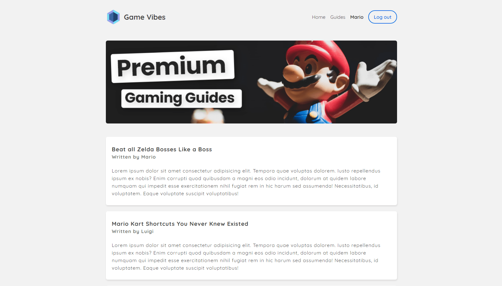

# Next.js basics

This repo is made of 4 projects:

1. [**Batman App**](#batman): A web app about Batman TV Shows to understand Next.js basics.
2. [**Blog App**](#blog): A very simple blog app.
3. [**Game Vibes**](#gamevibes): A quick project using Netlify Identity with Next.js.
4. [**Marmite**](#marmite): A small recipe app combining Next.js with Contentful.

## 1) Batman app

A web app about Batman TV Shows to understand Next.js basics.

[See batman folder](https://github.com/solygambas/next-batman/tree/master/batman)

### Demo

[See Demo deployed on Now](https://hello-next.solygambas.now.sh/)

### Features

- starting a Next.js project.
- navigating between pages with Link.
- using shared components for layout with props.children.
- creating dynamic pages with useRouter.
- creating clean URLs with dynamic routing.
- fetching data from TVmaze API with isomorphic-unfetch and getInitialProps.
- styling components with styled-jsx and react-markdown.
- deploying on ZEIT Now.
- exporting into a static HTML app.

## 2) Blog app

A very simple blog app.

[See blog folder](https://github.com/solygambas/next-batman/tree/master/blog)

### Demo

[See Demo deployed on Vercel](https://next-blog-dagny.vercel.app/)

### Features

- creating a Next.js app.
- navigating between pages with Link.
- creating a layout and handling metadata with Head.
- styling pages with CSS modules and global import via \_app.
- serving static assets like images with public folder.
- fetching markdown posts with gray-matter and getStaticProps.
- handling dynamic routes with getStaticPaths.
- rendering markdown with remark and remark-html.
- formatting dates with date-fns.
- creating an API route.
- deploying on Vercel.

Based on [Learn Next.js](https://nextjs.org/learn).

## 3) Game Vibes

A quick project using Netlify Identity with Next.js.

[See game-vibes folder](https://github.com/solygambas/next-batman/tree/master/game-vibes)

## Demo

[See Demo deployed on Netlify](https://gamevibes.netlify.app/)
(Email: mario@bros.com - Password: mariobros)

    

## Features

- installing Netlify Identity Widget and deploying on Netlify.
- creating an auth context with useContext.
- handling sign up, log in and log out.
- customizing the navbar for connected users.
- using Netlify Functions to protect content.
- enabling Google and GitHub as auth providers.

Based on [Next.js & Identity (auth) Tutorial](https://www.youtube.com/watch?v=IM7a6BxNof8&list=PL4cUxeGkcC9ig-veuRaLI4QB0Ws8xMzjv) by Shaun Pelling - The Net Ninja (2021).

## 4) Marmite

A small recipe app combining Next.js with Contentful.

[See marmite folder](https://github.com/solygambas/next-batman/tree/master/marmite)

## Demo

[See Demo deployed on Vercel](https://justaddmarmite.vercel.app/)

    

## Features

- building a content model and adding recipes on Contentful.
- configuring Contentful client in a Next.js project.
- outputting recipe data with getStaticProps.
- using images from Contentful with next.config.js.
- customizing the layout with styled JSX.
- generating paths for recipe details with getStaticPaths.
- rendering formatted content with Contentful rich text renderer.
- handling incremental static regeneration with revalidate.
- displaying a skeleton to handle server-side rendering on new recipes.
- building a custom 404 page and redirecting users.
- creating a Vercel deploy hook to trigger builds from Contentful.
- deploying to Vercel.

Based on [Next.js & Contentful Site Build Tutorial](https://www.youtube.com/watch?v=m9mNsYJbkNg&list=PL4cUxeGkcC9jClk8wl1yJcN3Zlrr8YSA1) by Shaun Pelling - The Net Ninja (2021).
