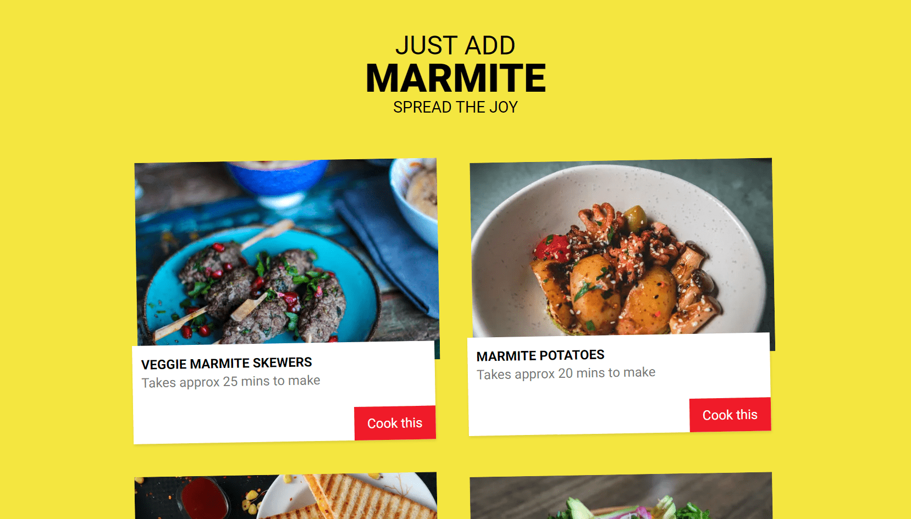

# Marmite

A small recipe app combining Next.js with Contentful.

## Demo

[See Demo deployed on Vercel](https://justaddmarmite.vercel.app/)

        

## Features

- building a content model and adding recipes on Contentful.
- configuring Contentful client in a Next.js project.
- outputting recipe data with getStaticProps.
- using images from Contentful with next.config.js.
- customizing the layout with styled JSX.
- generating paths for recipe details with getStaticPaths.
- rendering formatted content with Contentful rich text renderer.
- handling incremental static regeneration with revalidate.
- displaying a skeleton to handle server-side rendering on new recipes.
- building a custom 404 page and redirecting users.
- creating a Vercel deploy hook and trigger builds from Contentful.
- deploying to Vercel.

Based on [Next.js & Contentful Site Build Tutorial](https://www.youtube.com/watch?v=m9mNsYJbkNg&list=PL4cUxeGkcC9jClk8wl1yJcN3Zlrr8YSA1) by Shaun Pelling - The Net Ninja (2021).
